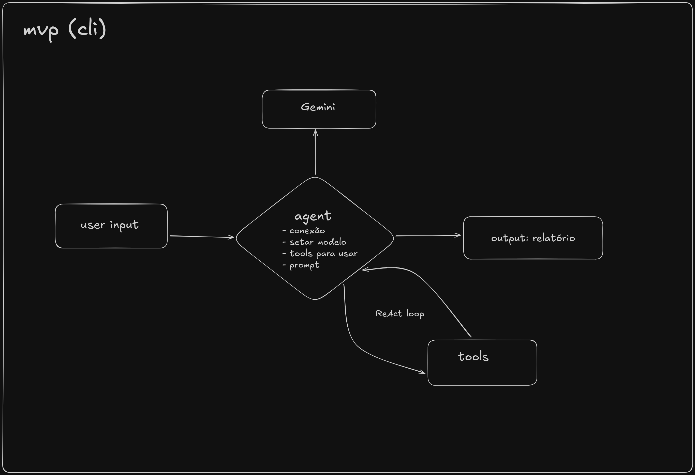

# 🤖 Desafio Olimpia

Este projeto utiliza **LangChain** juntamente com o modelo **Gemini** da
Google para criar agentes inteligentes.\
Abaixo estão todas as instruções necessárias para configurar ambiente,
instalar dependências e executar o projeto.


------------------------------------------------------------------------

# 🔑 1. Obtendo sua API Key do Google Gemini

Para usar o modelo Gemini, é necessário gerar uma API Key no Google AI
Studio.

### 👉 Gere sua chave aqui:

https://aistudio.google.com/app/apikey

Após criar sua chave, você deverá colocá-la no arquivo **.env** deste
projeto.

------------------------------------------------------------------------

# 📄 2. Configurando o arquivo `.env`

Crie um arquivo chamado:

    .env

E dentro dele coloque:

    API_KEY=<sua-key-aqui>

O projeto já inclui um arquivo de exemplo chamado:

    .env_example

Use-o como referência caso necessário.

------------------------------------------------------------------------

# 🌍 3. Criando o ambiente virtual

## 🪟 Windows

### Criar o ambiente:

``` powershell
python -m venv venv
```

### Ativar:

``` powershell
venv\Scripts\activate
```

------------------------------------------------------------------------

## 🐧 Linux / macOS

### Criar o ambiente:

``` bash
python3 -m venv venv
```

### Ativar:

``` bash
source venv/bin/activate
```

------------------------------------------------------------------------

# 📥 4. Instalando as dependências

Com o ambiente virtual ativo:

## Windows:

``` powershell
pip install -r requirements.txt
```

## Linux / macOS:

``` bash
pip3 install -r requirements.txt
```

------------------------------------------------------------------------

# ▶️ 5. Executando o projeto

Use:

``` bash
python3 main.py
```

Se estiver no Windows e `python3` não existir:

``` powershell
python main.py
```

------------------------------------------------------------------------

# 📝 Licença

Este projeto é distribuído sob a licença MIT.
